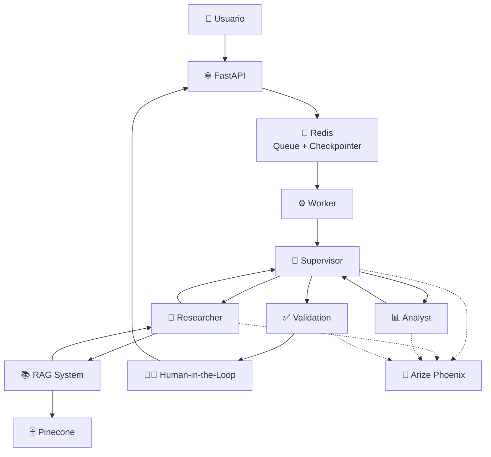
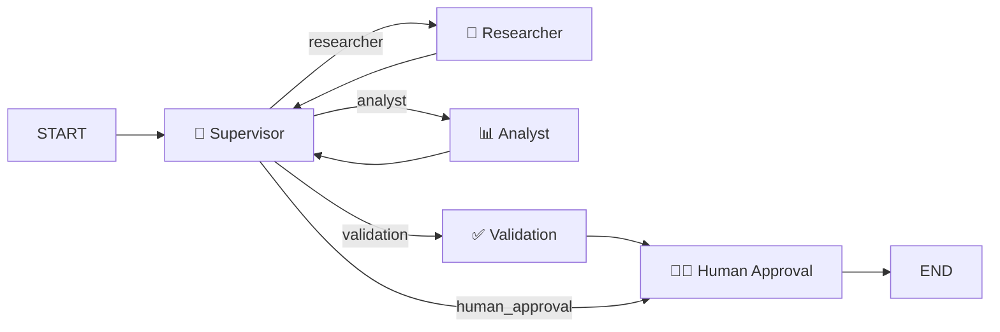
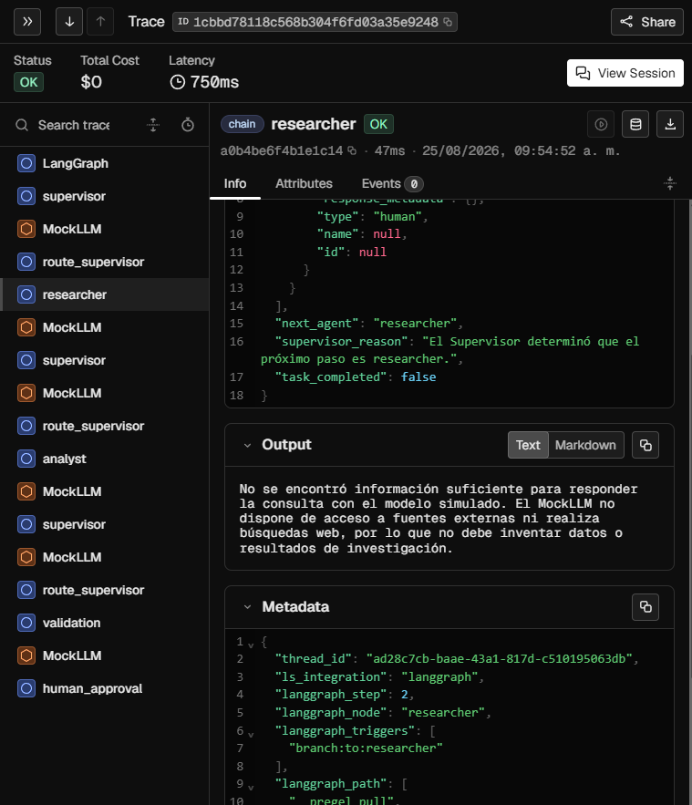
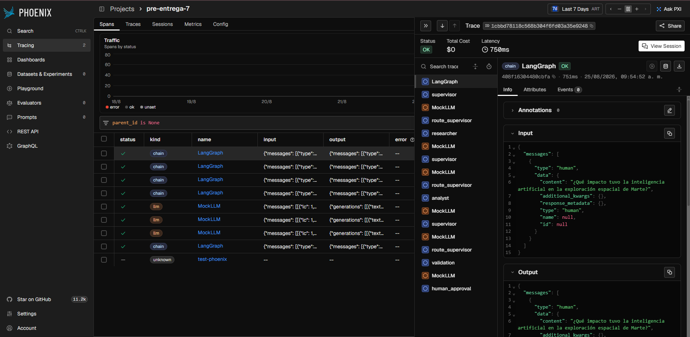

# 🤖 Intelligence System — Final Project

Sistema multi-agente de inteligencia artificial desarrollado con **Python, LangGraph, FastAPI, Redis, Pinecone, Pydantic y Arize Phoenix**.

El proyecto implementa una arquitectura de agentes especializados coordinados mediante un **Supervisor**, con persistencia de estado, recuperación de información mediante **RAG**, validación estructurada, intervención humana (**Human-in-the-Loop**) y observabilidad mediante trazas.

---

## 📋 Índice

* [Descripción](#-descripción)
* [Objetivos](#-objetivos)
* [Arquitectura](#-arquitectura)
* [Flujo del sistema](#-flujo-del-sistema)
* [Agentes](#-agentes)
* [RAG](#-rag-retrieval-augmented-generation)
* [Human-in-the-Loop](#-human-in-the-loop)
* [Persistencia](#-persistencia)
* [Comunicación asíncrona](#-comunicación-asíncrona)
* [Pydantic](#-pydantic)
* [Observabilidad](#-observabilidad)
* [API REST](#-api-rest)
* [Estructura del proyecto](#-estructura-del-proyecto)
* [Variables de entorno](#-variables-de-entorno)
* [Instalación](#-instalación)
* [Ejecución](#-ejecución)
* [Ejemplo de uso](#-ejemplo-de-uso)
* [Testing](#-testing)
* [Tecnologías](#-tecnologías)
* [Estado del proyecto](#-estado-del-proyecto)

---

# 📖 Descripción

**Intelligence System** es un sistema multi-agente diseñado para resolver tareas de investigación y análisis mediante una secuencia controlada de agentes especializados.

El sistema utiliza un **Supervisor** que determina qué agente debe ejecutarse en cada etapa del flujo.

La arquitectura está compuesta por:

* 🔎 **Researcher Agent**
* 📊 **Analyst Agent**
* ✅ **Validation Agent**
* 🧑‍💻 **Human-in-the-Loop**
* 🧠 **Supervisor**
* 📚 **RAG con Pinecone**
* 💾 **Redis**
* 🌐 **FastAPI**
* 📦 **Pydantic**
* 🔭 **Arize Phoenix**

El flujo completo es persistente y permite pausar la ejecución para solicitar una decisión humana antes de finalizar la tarea.

---

# 🎯 Objetivos

Los principales objetivos de esta implementación son:

1. Construir una arquitectura multi-agente utilizando **LangGraph**.
2. Implementar comunicación completamente asíncrona.
3. Incorporar un sistema **RAG** para recuperar información desde una base de conocimiento.
4. Utilizar **Pinecone** como vector database.
5. Implementar persistencia del estado mediante **Redis**.
6. Incorporar un mecanismo de **Human-in-the-Loop**.
7. Validar entradas y salidas mediante **Pydantic**.
8. Implementar observabilidad mediante **Arize Phoenix**.
9. Incorporar pruebas automatizadas del sistema.
10. Exponer la funcionalidad mediante una **API REST con FastAPI**.

---

# 🏗️ Arquitectura

La arquitectura general del sistema es la siguiente:



---

# 🔄 Flujo del sistema

La ejecución sigue las siguientes etapas:

```text
Usuario
   │
   ▼
FastAPI
   │
   ▼
Redis Queue
   │
   ▼
Worker
   │
   ▼
Supervisor
   │
   ├──► Researcher
   │       │
   │       ▼
   │      RAG
   │       │
   │       ▼
   │    Pinecone
   │
   ▼
Supervisor
   │
   ▼
Analyst
   │
   ▼
Supervisor
   │
   ▼
Validation
   │
   ▼
Human-in-the-Loop
   │
   ├──► Aprobar ──► COMPLETED
   │
   └──► Rechazar ─► REJECTED
```

El **Supervisor** controla el estado de la ejecución y determina cuál es el siguiente nodo.

La secuencia normal es:

```text
researcher
     ↓
analyst
     ↓
validation
     ↓
human_approval
     ↓
END
```

---

# 🧠 Supervisor

El Supervisor es el componente encargado de controlar el flujo del sistema.

Analiza el estado actual y determina qué etapa falta completar.

Las decisiones posibles son:

```text
researcher
analyst
validation
human_approval
```

La lógica es:

### 1. Sin investigación

Si todavía no existe `research_results`:

```text
Supervisor → Researcher
```

### 2. Investigación disponible

Si existe investigación pero no análisis:

```text
Supervisor → Analyst
```

### 3. Investigación y análisis disponibles

Si todavía no existe validación:

```text
Supervisor → Validation
```

### 4. Todo validado

Cuando todas las etapas están completas:

```text
Supervisor → Human Approval
```

Esto permite que el flujo sea determinístico y fácilmente trazable.

---

# 🔎 Researcher Agent

El **Researcher Agent** es responsable de realizar la investigación.

Su funcionamiento es:

1. Obtiene la consulta del usuario.
2. Consulta el sistema RAG.
3. Recupera documentos relevantes desde Pinecone.
4. Construye el contexto.
5. Envía el contexto al LLM.
6. Genera el resultado de investigación.
7. Valida la salida mediante Pydantic.
8. Guarda el resultado en el estado de LangGraph.

El agente trabaja exclusivamente con el contexto recuperado.

Esto permite reducir la generación de información no respaldada por la base de conocimiento.

---

# 📚 RAG — Retrieval Augmented Generation

El sistema incorpora un pipeline **RAG** para proporcionar contexto al agente Researcher.

La arquitectura es:

```text
Consulta
   │
   ▼
RAG System
   │
   ▼
Pinecone
   │
   ▼
Documentos relevantes
   │
   ▼
Contexto
   │
   ▼
Researcher
   │
   ▼
LLM
```

## Base de conocimiento

Los documentos utilizados como conocimiento se encuentran en:

```text
documents/
├── chunking.md
├── embeddings.md
├── hybrid-search.md
├── langchain.md
└── pinecone.md
```

Estos documentos son ingeridos en Pinecone mediante:

```bash
py -m app.rag.ingest
```

---

## 🔍 Pinecone

El sistema utiliza **Pinecone** como base de datos vectorial.

La configuración utiliza:

* Índice: `intelligence-system`
* Dimensión: `1024`
* Modelo de embeddings integrado: `llama-text-embed-v2`
* Namespace: `pre-entrega4`

La recuperación se realiza mediante las capacidades de búsqueda integradas de Pinecone.

Además, el sistema cuenta con una estrategia de búsqueda híbrida que permite combinar recuperación semántica y búsqueda basada en términos cuando corresponde.

---

# 📊 Analyst Agent

El **Analyst Agent** recibe los resultados generados por Researcher y realiza el análisis correspondiente.

Su responsabilidad es exclusivamente analizar la información proporcionada.

El flujo es:

```text
Researcher
    │
    ▼
research_results
    │
    ▼
Analyst
    │
    ▼
analysis_results
```

El agente utiliza una salida estructurada:

```python
class AnalystOutput(BaseModel):
    analysis_results: str
```

La respuesta es validada mediante **Pydantic** antes de almacenarse en el estado.

---

# ✅ Validation Agent

El **Validation Agent** es un nodo determinístico encargado de verificar que las etapas anteriores hayan producido resultados válidos.

Comprueba:

* Existencia de `research_results`.
* Existencia de `analysis_results`.

Si falta alguno de estos resultados, la validación falla.

Si ambos están presentes:

```text
VALIDATION OK
```

La salida utiliza Pydantic:

```python
class ValidationOutput(BaseModel):
    validation_result: str
    task_completed: bool
```

La validación no utiliza un LLM, lo que permite mantener esta etapa controlada y determinística.

---

# 🧑‍💻 Human-in-the-Loop

Una de las características principales del sistema es la incorporación de una etapa de **Human-in-the-Loop**.

Una vez finalizadas la investigación, el análisis y la validación, el flujo se pausa y solicita una decisión humana.

```text
Validation
     │
     ▼
Human Approval
     │
     ├──────────────┐
     │              │
   APPROVE        REJECT
     │              │
     ▼              ▼
COMPLETED        REJECTED
```

La pausa se implementa utilizando las capacidades de interrupción de LangGraph.

La decisión se reanuda mediante:

```python
Command(resume=request.approved)
```

El estado se mantiene asociado al mismo `thread_id`, permitiendo continuar exactamente desde el punto donde se pausó el flujo.

---

# 💾 Persistencia

El sistema utiliza **Redis** para diferentes responsabilidades.

## Redis Queue

Las tareas enviadas a la API se almacenan en una cola:

```text
ai_tasks_queue
```

El Worker consume las tareas pendientes.

```text
FastAPI
   │
   ▼
Redis Queue
   │
   ▼
Worker
```

## LangGraph Checkpointer

Además, Redis se utiliza como mecanismo de persistencia para LangGraph mediante:

```python
AsyncRedisSaver
```

Esto permite almacenar el estado de las ejecuciones y continuar un flujo después de una interrupción.

---

# ⚡ Comunicación asíncrona

Uno de los objetivos principales de esta entrega fue eliminar las comunicaciones bloqueantes.

Los principales componentes utilizan `async/await`.

Ejemplos:

```python
async def research_node(...):
```

```python
response = await llm.ainvoke(...)
```

```python
retrieved_documents = await rag.retrieve(...)
```

El acceso a Pinecone se ejecuta mediante operaciones compatibles con el flujo asíncrono.

Redis también se utiliza mediante clientes y mecanismos asíncronos.

Esto permite que el sistema pueda manejar tareas sin bloquear innecesariamente el event loop.

---

# 📦 Pydantic

Pydantic se utiliza para validar las estructuras de entrada y salida.

## API

La API utiliza modelos como:

```text
TaskRequest
TaskResponse
ApprovalRequest
ApprovalResponse
TaskStatusResponse
HealthResponse
```

## Agentes

También se utilizan modelos específicos para las salidas:

```text
ResearchOutput
AnalystOutput
ValidationOutput
```

Esto proporciona:

* Validación de datos.
* Tipado explícito.
* Contratos claros.
* Mayor robustez.
* Errores detectables temprano.
* Documentación automática de la API.

---

# 🔭 Observabilidad

El proyecto incorpora **Arize Phoenix** para observar las ejecuciones del sistema.

Las trazas permiten analizar:

* Ejecución de agentes.
* Flujo del sistema.
* Llamadas al LLM.
* Duración de operaciones.
* Errores.
* Recuperación de información.
* Flujo general de cada tarea.

La configuración utiliza:

```env
PHOENIX_ENDPOINT=http://localhost:6006/v1/traces
PHOENIX_PROJECT=pre-entrega-7
```

El proyecto incluye evidencias de observabilidad:

```text
screenshots/
├── phoenix-researcher.png
└── phoenix-trace.png
```

Estas capturas muestran las trazas generadas durante la ejecución del sistema.

---

# 🌐 API REST

La aplicación expone una API mediante **FastAPI**.

El archivo principal de la API es:

```text
app/api.py
```

---

## Crear una tarea

```http
POST /tasks
```

Ejemplo:

```json
{
  "query": "¿Qué es Retrieval Augmented Generation?"
}
```

La API genera un identificador único para la tarea.

Respuesta:

```json
{
  "job_id": "uuid",
  "status": "queued"
}
```

---

## Consultar una tarea

```http
GET /tasks/{job_id}
```

Permite conocer el estado actual de la ejecución.

Los estados principales incluyen:

```text
queued
running
waiting_approval
completed
rejected
```

---

## Aprobar o rechazar una tarea

```http
POST /tasks/{job_id}/approve
```

Ejemplo:

```json
{
  "approved": true
}
```

Para rechazar:

```json
{
  "approved": false
}
```

La decisión humana permite continuar o finalizar el flujo.

---

## Health Check

```http
GET /health
```

Permite comprobar el estado básico del servicio y la conexión con Redis.

---

# 📁 Estructura del proyecto

```text
Intelligence-System-Final/
│
├── app/
│   ├── __init__.py
│   ├── api.py
│   ├── graph.py
│   ├── llm.py
│   ├── main.py
│   ├── observability.py
│   ├── redis_client.py
│   ├── state.py
│   ├── worker.py
│   │
│   ├── agents/
│   │   ├── __init__.py
│   │   ├── analyst_agent.py
│   │   ├── hitl.py
│   │   ├── research_agent.py
│   │   └── validation_agent.py
│   │
│   └── rag/
│       ├── __init__.py
│       ├── ingest.py
│       ├── pinecone_client.py
│       └── rag_system.py
│
├── documents/
│   ├── chunking.md
│   ├── embeddings.md
│   ├── hybrid-search.md
│   ├── langchain.md
│   └── pinecone.md
│
├── screenshots/
│   ├── phoenix-researcher.png
│   └── phoenix-trace.png
│
├── tests/
│   ├── test_hitl.py
│   ├── test_persistence.py
│   ├── test_validation.py
│   └── test_pydantic.py
│
├── .env
├── .gitignore
├── docker-compose.yml
├── README.md
└── requirements.txt
```

---

# ⚙️ Variables de entorno

El proyecto utiliza variables de entorno para separar la configuración del código.

Ejemplo:

```env
REDIS_URL=redis://localhost:6376

QUEUE_NAME=ai_tasks_queue

STATUS_PREFIX=task_status:

PHOENIX_ENDPOINT=http://localhost:6006/v1/traces

PHOENIX_PROJECT=pre-entrega-7

GEMINI_API_KEY=your_api_key

GEMINI_MODEL=gemini-3.6-flash

PINECONE_API_KEY=your_api_key

INDEX_NAME=intelligence-system
```

Las credenciales reales deben mantenerse fuera del repositorio.

El archivo `.env` está excluido mediante `.gitignore`.

---

# 🚀 Instalación

## 1. Clonar el repositorio

```bash
git clone <URL_DEL_REPOSITORIO>
```

Entrar al proyecto:

```bash
cd Intelligence-System-Final
```

---

## 2. Crear entorno virtual

```bash
py -m venv .venv
```

Activarlo en Windows:

```powershell
.\.venv\Scripts\Activate.ps1
```

---

## 3. Instalar dependencias

```bash
py -m pip install -r requirements.txt
```

---

## 4. Configurar variables de entorno

Crear un archivo:

```text
.env
```

y completar las variables necesarias.

---

# 🐳 Infraestructura con Docker

Redis se ejecuta mediante Docker Compose.

Para iniciar la infraestructura:

```bash
docker compose up -d
```

Esto permite levantar los servicios necesarios para la persistencia y cola de tareas.

Para detenerlos:

```bash
docker compose down
```

---

# 📚 Ingesta de documentos

Antes de utilizar el RAG es posible ejecutar la ingesta de la base de conocimiento:

```bash
py -m app.rag.ingest
```

Los documentos se procesan y almacenan en Pinecone.

---

# ▶️ Ejecución

El sistema se compone principalmente de dos procesos:

### API

Desde la raíz del proyecto:

```bash
py -m uvicorn app.api:app --reload
```

La API estará disponible en:

```text
http://127.0.0.1:8000
```

La documentación interactiva de FastAPI está disponible en:

```text
http://127.0.0.1:8000/docs
```

### Worker

En otra terminal:

```bash
py -m app.worker
```

El Worker consume las tareas almacenadas en Redis y ejecuta el grafo multi-agente.

---

# 🧪 Ejemplo de uso

## 1. Crear una tarea

Enviar una solicitud:

```http
POST /tasks
```

con:

```json
{
  "query": "Explicá qué es RAG y cómo funciona Pinecone."
}
```

---

## 2. Obtener el `job_id`

La API devuelve un identificador:

```json
{
  "job_id": "xxxxxxxx-xxxx-xxxx-xxxx-xxxxxxxxxxxx",
  "status": "queued"
}
```

---

## 3. Consultar el estado

```http
GET /tasks/{job_id}
```

Durante la ejecución el estado puede evolucionar:

```text
queued
   ↓
running
   ↓
waiting_approval
```

---

## 4. Aprobar

Cuando el sistema llega al Human-in-the-Loop:

```http
POST /tasks/{job_id}/approve
```

con:

```json
{
  "approved": true
}
```

El flujo continúa y termina como:

```text
completed
```

---

## 5. Rechazar

También es posible rechazar el resultado:

```json
{
  "approved": false
}
```

En ese caso:

```text
rejected
```

y:

```text
task_completed = false
```

Esto evita marcar incorrectamente como completada una tarea rechazada.

---

# 🧪 Testing

El proyecto cuenta con pruebas automatizadas utilizando **pytest**.

Actualmente se incluyen pruebas para:

* Human-in-the-Loop.
* Persistencia con Redis.
* Validación del flujo.
* Validación Pydantic.
* Rechazo de salidas inválidas.

Ejecutar todos los tests:

```bash
py -m pytest -q
```

Resultado actual:

```text
6 passed
```

Las pruebas permiten verificar distintos componentes críticos de la arquitectura.

---

# 🔐 Manejo de errores y robustez

El sistema incorpora diferentes mecanismos para mejorar la robustez:

### Variables de entorno

Las credenciales y configuraciones sensibles se mantienen fuera del código.

### Validación

Pydantic permite detectar estructuras inválidas antes de que sean utilizadas.

### Persistencia

Redis permite conservar el estado de las ejecuciones.

### Checkpointing

LangGraph utiliza `AsyncRedisSaver` para mantener el estado del grafo.

### Validación determinística

El agente Validation comprueba explícitamente que las etapas anteriores hayan generado resultados.

### Fallback del LLM

El sistema dispone de un mecanismo de fallback para mantener la ejecución disponible cuando el proveedor principal no puede responder.

---

# 🧩 Estado del sistema

El estado compartido de LangGraph se encuentra definido en:

```text
app/state.py
```

Incluye información como:

```text
messages
research_results
analysis_results
validation_result
next_agent
supervisor_reason
human_approved
task_completed
```

Este estado permite que los diferentes agentes compartan información durante la ejecución.

---

# 🔄 Grafo de LangGraph

El grafo principal se encuentra en:

```text
app/graph.py
```

La estructura conceptual es:



El Checkpointer utilizado por el grafo es:

```python
AsyncRedisSaver
```

Esto permite persistir las ejecuciones y recuperar el estado mediante el `thread_id`.

---

# 🔭 Evidencia de observabilidad

El repositorio incluye capturas de las trazas generadas durante las ejecuciones:

### Researcher



### Traza completa



Estas evidencias permiten verificar la instrumentación y observabilidad del sistema.

---

# 🛠️ Tecnologías utilizadas

| Tecnología    | Utilización                           |
| ------------- | ------------------------------------- |
| Python        | Lenguaje principal                    |
| LangGraph     | Orquestación multi-agente             |
| LangChain     | Integración con LLM y componentes RAG |
| FastAPI       | API REST                              |
| Pydantic      | Validación de datos                   |
| Redis         | Cola y persistencia                   |
| Pinecone      | Vector database                       |
| Gemini        | Modelo LLM                            |
| Arize Phoenix | Observabilidad                        |
| Pytest        | Testing                               |
| Docker        | Infraestructura local                 |

---

# 📌 Principales características

### Arquitectura multi-agente

Separación de responsabilidades entre:

```text
Researcher
Analyst
Validation
Human Approval
```

### Arquitectura RAG

El Researcher consulta una base de conocimiento antes de generar información.

### Ejecución asíncrona

Las operaciones principales utilizan:

```python
async
await
```

### Persistencia

El estado del grafo se conserva mediante Redis.

### Human-in-the-Loop

El sistema puede detenerse para recibir una decisión humana.

### Validación

Las entradas y salidas principales utilizan modelos Pydantic.

### Observabilidad

Las ejecuciones pueden inspeccionarse mediante Arize Phoenix.

### Testing

El sistema cuenta con pruebas automatizadas para validar componentes críticos.

---

# 📈 Flujo completo de una tarea

```text
                 ┌───────────────┐
                 │    Usuario    │
                 └───────┬───────┘
                         │
                         ▼
                 ┌───────────────┐
                 │    FastAPI    │
                 └───────┬───────┘
                         │
                         ▼
                 ┌───────────────┐
                 │     Redis     │
                 │     Queue     │
                 └───────┬───────┘
                         │
                         ▼
                 ┌───────────────┐
                 │    Worker     │
                 └───────┬───────┘
                         │
                         ▼
                 ┌───────────────┐
                 │   Supervisor  │
                 └───────┬───────┘
                         │
                         ▼
                 ┌───────────────┐
                 │   Researcher  │
                 └───────┬───────┘
                         │
                         ▼
                 ┌───────────────┐
                 │      RAG      │
                 └───────┬───────┘
                         │
                         ▼
                 ┌───────────────┐
                 │    Pinecone   │
                 └───────┬───────┘
                         │
                         ▼
                 ┌───────────────┐
                 │    Analyst    │
                 └───────┬───────┘
                         │
                         ▼
                 ┌───────────────┐
                 │   Validation  │
                 └───────┬───────┘
                         │
                         ▼
                 ┌───────────────┐
                 │ Human Approval│
                 └───────┬───────┘
                         │
                 ┌───────┴───────┐
                 ▼               ▼
             APPROVED          REJECTED
                 │               │
                 ▼               ▼
             COMPLETED        REJECTED
```

---

# 🎓 Conclusión

Este proyecto integra los principales conceptos trabajados durante el desarrollo del sistema:

* Arquitecturas multi-agente.
* Orquestación con LangGraph.
* RAG.
* Vector databases.
* Comunicación asíncrona.
* Persistencia.
* Checkpointing.
* Human-in-the-Loop.
* Validación estructurada.
* APIs REST.
* Testing.
* Observabilidad.

El resultado es un sistema modular, persistente, observable y preparado para ejecutar tareas de investigación y análisis mediante agentes especializados.

---

# 📋 Estado del proyecto

| Componente                | Estado |
| ------------------------- | ------ |
| Arquitectura multi-agente | ✅      |
| Supervisor                | ✅      |
| Researcher                | ✅      |
| Analyst                   | ✅      |
| Validation                | ✅      |
| RAG                       | ✅      |
| Pinecone                  | ✅      |
| Redis Queue               | ✅      |
| LangGraph Checkpointer    | ✅      |
| Async/Await               | ✅      |
| Pydantic                  | ✅      |
| Human-in-the-Loop         | ✅      |
| FastAPI                   | ✅      |
| Arize Phoenix             | ✅      |
| Tests                     | ✅ 6/6  |
| Documentación             | ✅      |
| Despliegue local          | ✅      |
