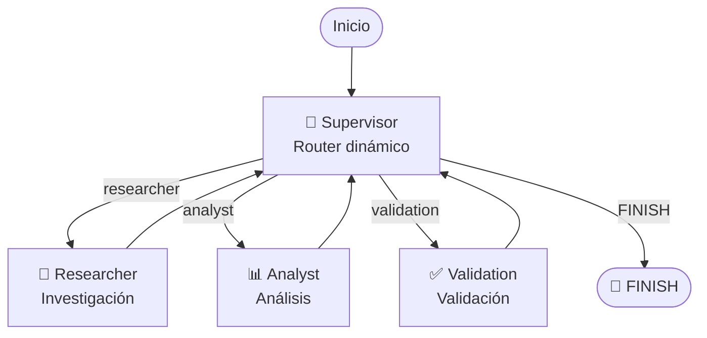

# 🤖 Pre-entrega 6: Orquestador Multi-Agente Especializado

## 📌 Descripción

Este proyecto implementa un **Orquestador Multi-Agente de Análisis e Investigación** utilizando **LangGraph, LangChain y Python**.

El sistema recibe una consulta compleja y distribuye el trabajo entre diferentes agentes especializados.

La arquitectura utiliza una **topología jerárquica**, donde un nodo **Supervisor** controla el flujo de ejecución y decide dinámicamente qué especialista debe intervenir en cada etapa.

El sistema cuenta con:

- 👑 **Supervisor:** controla y enruta el flujo.
- 🔎 **Researcher:** realiza tareas de investigación utilizando una herramienta de búsqueda.
- 📊 **Analyst:** procesa y analiza la información obtenida utilizando una herramienta de cálculo.
- ✅ **Validation:** verifica que los resultados necesarios estén disponibles antes de finalizar.
- 🧠 **Estado compartido:** permite conservar los resultados generados por cada agente.
- 🔄 **Conditional Edges:** permiten que el Supervisor determine dinámicamente el siguiente nodo.
- 🖥️ **Streaming:** permite visualizar en consola cada etapa del proceso.
- 🤖 **OpenAI / MockLLM:** el proyecto puede ejecutarse utilizando OpenAI o un modelo simulado local sin necesidad de una API.

---

# 🎯 Objetivo

El objetivo de la práctica es construir un prototipo funcional de un sistema multi-agente capaz de:

1. Recibir una consulta compleja.
2. Determinar qué especialista debe intervenir.
3. Ejecutar una investigación.
4. Analizar los resultados obtenidos.
5. Validar la información.
6. Decidir si el proceso está completo.
7. Finalizar de forma controlada.

El flujo implementado evita que todos los agentes reciban y procesen innecesariamente toda la información disponible, manteniendo una separación clara de responsabilidades.

---

# 🏗️ Arquitectura

La arquitectura implementada corresponde a una **topología jerárquica**.

El Supervisor funciona como controlador central del flujo.



El flujo normal de ejecución es:

```text
SUPERVISOR
    ↓
RESEARCHER
    ↓
SUPERVISOR
    ↓
ANALYST
    ↓
SUPERVISOR
    ↓
VALIDATION
    ↓
SUPERVISOR
    ↓
FINISH
```

---

# 👑 Supervisor

El Supervisor es el componente encargado de coordinar el flujo del sistema multi-agente.

Su función es analizar el estado actual de la ejecución y determinar cuál debe ser el próximo agente en intervenir.

Para tomar esta decisión, el Supervisor consulta el modelo configurado en `llm.py`, que puede ser:

- 🤖 `ChatOpenAI`, cuando existe una `OPENAI_API_KEY`.
- ⚠️ `MockLLM`, cuando no se dispone de una API.

El Supervisor recibe información sobre el estado actual del proceso, incluyendo:

- Resultado de investigación.
- Resultado del análisis.
- Resultado de validación.

A partir de esta información, el modelo debe seleccionar una de las siguientes opciones:

```text
researcher
analyst
validation
finish
```
---

# 🔀 Routing dinámico

El routing se implementa mediante `Conditional Edges` de LangGraph.

La función `route_supervisor` utiliza `Literal` para definir explícitamente las rutas posibles:

```python
def route_supervisor(
    state: AgentState,
) -> Literal[
    "researcher",
    "analyst",
    "validation",
    "FINISH",
]:
    return state["next_agent"]
```

El Supervisor actualiza el campo:

```text
next_agent
```

y LangGraph utiliza ese valor para determinar el próximo nodo.

De esta manera, el flujo no está definido únicamente como una secuencia fija, sino que existe una decisión centralizada que controla la ejecución.

---

# 🔎 Agente Researcher

El agente `Researcher` está especializado en tareas de investigación.

Utiliza una herramienta propia llamada:

```text
search_knowledge_base
```

Esta herramienta consulta una base de conocimiento simulada incluida en el proyecto.

La base contiene información relacionada con:

- Inteligencia artificial.
- Mercado laboral.
- Empleo.
- Productividad.

Ejemplo de información disponible:

```text
La adopción de herramientas de inteligencia artificial aumentó un 35%
en las empresas analizadas.

El 62% de las empresas incorporaron herramientas de automatización
durante el último año.

La incorporación de inteligencia artificial está modificando
principalmente tareas repetitivas y administrativas.

Las empresas que incorporaron herramientas de inteligencia artificial
reportaron mejoras en productividad.
```

La herramienta está limitada a la función de búsqueda dentro de la base de conocimiento.

El agente utiliza `create_react_agent` de LangGraph para interactuar con la herramienta.

---

# 📊 Agente Analyst

El agente `Analyst` está especializado en el procesamiento y análisis de los resultados obtenidos por el Researcher.

Cuenta con una herramienta propia:

```text
calculate_average
```

Esta herramienta permite calcular el promedio de una lista de valores numéricos.

Ejemplo:

```text
10, 20, 30, 40
```

Resultado:

```text
El promedio de los valores analizados es 25.00.
```

El Analyst recibe los resultados producidos por el Researcher a través del estado compartido y genera una interpretación de los datos.

También utiliza `create_react_agent`.

---

# ✅ Validation

El nodo `Validation` funciona como una etapa de control antes de finalizar el proceso.

Su objetivo es verificar que existan los resultados necesarios:

```text
research_results
analysis_results
```

Si falta alguno de estos resultados, la validación devuelve un error y el proceso no se considera terminado.

Si ambos resultados están disponibles, genera:

```text
VALIDATION OK
```

y marca:

```text
task_completed = True
```

Además, actualiza:

```text
validation_result
```

Esto permite que el Supervisor sepa que la etapa de validación ya fue completada y pueda decidir correctamente finalizar el flujo.

La validación es determinística y no depende del LLM, lo que permite garantizar una condición de finalización clara.

---

# 🧠 Estado compartido

El estado del sistema se define en:

```text
state.py
```

El esquema hereda de `MessagesState` de LangGraph.

```python
class AgentState(MessagesState):

    research_results: Optional[str]

    analysis_results: Optional[str]

    validation_result: Optional[str]

    next_agent: Optional[str]

    supervisor_reason: Optional[str]

    task_completed: bool
```

## Campos principales

### `messages`

Hereda de `MessagesState` y permite conservar los mensajes de la ejecución.

### `research_results`

Almacena el resultado generado por el agente Researcher.

### `analysis_results`

Almacena el resultado generado por el agente Analyst.

### `validation_result`

Almacena el resultado de la etapa de validación.

### `next_agent`

Indica qué nodo debe ejecutarse a continuación.

### `supervisor_reason`

Permite conservar una explicación de la decisión tomada por el Supervisor.

### `task_completed`

Indica si el proceso fue completado correctamente.

Este estado compartido permite que los diferentes componentes del grafo trabajen sobre una estructura común sin perder los resultados producidos por los agentes anteriores.

---

# 🤖 OpenAI y MockLLM

El proyecto puede funcionar utilizando dos modalidades.

## OpenAI

Si existe la variable de entorno:

```text
OPENAI_API_KEY
```

el sistema utiliza:

```python
ChatOpenAI(
    model="gpt-4o",
    temperature=0
)
```

Esto permite ejecutar el sistema utilizando un modelo real de OpenAI.

---

## MockLLM

Si no existe `OPENAI_API_KEY`, el sistema utiliza un `MockLLM` desarrollado específicamente para esta pre-entrega.

En ese caso aparece:

```text
⚠️ Usando MockLLM (modo simulación sin API)
```

El MockLLM reproduce las respuestas necesarias para demostrar el funcionamiento completo del sistema.

Esto permite ejecutar y probar el proyecto sin necesidad de disponer de una API externa.

El MockLLM contempla los diferentes roles del sistema:

```text
SUPERVISOR
RESEARCHER
ANALYST
```

De esta manera se puede demostrar la arquitectura multi-agente incluso sin credenciales externas.

---

# 📡 Streaming

La ejecución principal utiliza:

```python
app.astream(initial_state)
```

Esto permite visualizar progresivamente el flujo del grafo.

La consola muestra cada nodo ejecutado y el resultado producido.

Ejemplo:

```text
👑 SUPERVISOR
   └── Próximo agente: researcher

🔎 RESEARCHER
   └── Investigación completada

👑 SUPERVISOR
   └── Próximo agente: analyst

📊 ANALYST
   └── Análisis completado

👑 SUPERVISOR
   └── Próximo agente: validation

✅ VALIDATION
   ├── Investigación: OK
   ├── Análisis: OK
   └── Estado: VÁLIDO

👑 SUPERVISOR
   └── Próximo agente: FINISH
```

Esto permite observar claramente la delegación de tareas y el retorno de cada especialista al Supervisor.

---

# 🛑 Prevención de bucles infinitos

Uno de los riesgos de una arquitectura con Supervisor es generar un ciclo infinito.

Para evitarlo, el proyecto utiliza diferentes mecanismos:

1. El estado permite conocer qué etapas ya fueron completadas.
2. El Supervisor verifica la existencia de `research_results`, `analysis_results` y `validation_result`.
3. Validation actualiza `validation_result` cuando finaliza correctamente.
4. El Supervisor solamente puede seleccionar cuatro opciones válidas.
5. Existe un fallback determinístico si el LLM devuelve una respuesta inesperada.
6. Cuando todos los resultados están disponibles, el Supervisor devuelve `FINISH`.
7. `FINISH` está conectado directamente con `END`.

El flujo de finalización es:

```text
Validation
    ↓
Supervisor
    ↓
FINISH
    ↓
END
```

Por lo tanto, no existe un ciclo permanente entre Supervisor y Validation.

---

# 🔄 Manejo de contexto

El sistema utiliza un estado compartido estructurado para conservar únicamente la información necesaria para cada etapa.

El Researcher produce:

```text
research_results
```

El Analyst utiliza ese resultado para producir:

```text
analysis_results
```

Validation verifica ambos resultados y genera:

```text
validation_result
```

El Supervisor utiliza estos campos para decidir el siguiente paso.

De esta forma, cada agente tiene una responsabilidad concreta y el estado permite mantener la continuidad de la ejecución.

---

# ⚔️ Manejo de conflictos

La arquitectura no permite que los especialistas decidan directamente el flujo global.

Los agentes especializados producen resultados, pero el control permanece centralizado en el Supervisor.

Esto evita que un agente pueda modificar directamente la ruta global del grafo.

La etapa de Validation funciona además como una barrera antes de finalizar.

En caso de resultados incompletos, el sistema no permite finalizar correctamente.

---

# 📁 Estructura del proyecto

```text
pre-entrega-6/
│
├── agents/
│   ├── __init__.py
│   ├── research_agent.py
│   ├── analyst_agent.py
│   └── validation_agent.py
│
├── graph.py
├── llm.py
├── main.py
├── state.py
├── requirements.txt
├── .env.example
├── .gitignore
└── README.md
```

---

# 📄 Descripción de archivos

## `state.py`

Define el estado compartido del sistema utilizando `MessagesState`.

---

## `graph.py`

Contiene:

- Supervisor.
- Routing dinámico.
- Conditional Edges.
- Nodos de los agentes.
- Compilación del `StateGraph`.

---

## `main.py`

Ejecuta el orquestador y muestra el flujo mediante streaming.

---

## `llm.py`

Gestiona la selección entre:

- OpenAI.
- MockLLM.

---

## `agents/research_agent.py`

Contiene:

- Researcher.
- `search_knowledge_base`.
- `research_node`.

---

## `agents/analyst_agent.py`

Contiene:

- Analyst.
- `calculate_average`.
- `analyst_node`.

---

## `agents/validation_agent.py`

Contiene el nodo determinístico de validación.

---

# ⚙️ Instalación

## 1. Clonar el repositorio

```bash
git clone <URL_DEL_REPOSITORIO>
```

Entrar al proyecto:

```bash
cd pre-entrega-6
```

---

## 2. Crear entorno virtual

En Windows:

```bash
py -m venv venv
```

Activarlo:

```bash
venv\Scripts\activate
```

---

## 3. Instalar dependencias

```bash
py -m pip install -r requirements.txt
```

---

# 🔐 Configuración de OpenAI

El proyecto no requiere obligatoriamente una API de OpenAI.

Para utilizar OpenAI, crear un archivo:

```text
.env
```

con:

```text
OPENAI_API_KEY=tu_api_key
```

También se incluye:

```text
.env.example
```

como referencia.

Nunca se debe subir el archivo `.env` al repositorio.

---

# ▶️ Ejecución

Una vez instaladas las dependencias:

```bash
py main.py
```

Si no existe `OPENAI_API_KEY`, se utilizará automáticamente:

```text
MockLLM
```

Si existe la variable, se utilizará:

```text
OpenAI
```

---

# 🧪 Ejemplo de ejecución

Consulta utilizada:

```text
Analizá el impacto de la inteligencia artificial
en el mercado laboral y elaborá una conclusión.
```

Flujo obtenido:

```text
============================================================
🚀 ORQUESTADOR MULTI-AGENTE
============================================================

👑 SUPERVISOR
   └── Próximo agente: researcher

🔎 RESEARCHER
   └── Investigación completada
   └── Resultado:
       La investigación encontró que la adopción de
       herramientas de inteligencia artificial aumentó
       un 35% en las empresas analizadas.
       Además, el 62% incorporó herramientas de
       automatización durante el último año.

👑 SUPERVISOR
   └── Próximo agente: analyst

📊 ANALYST
   └── Análisis completado
   └── Resultado:
       El análisis indica una tendencia positiva en
       la adopción de inteligencia artificial.
       El promedio de los valores analizados es 48.50.
       Además, la automatización está creciendo y su
       impacto se concentra principalmente en tareas
       repetitivas y administrativas.

👑 SUPERVISOR
   └── Próximo agente: validation

✅ VALIDATION
   ├── Investigación: OK
   ├── Análisis: OK
   └── Estado: VÁLIDO

👑 SUPERVISOR
   └── Próximo agente: FINISH

============================================================
✅ PROCESO FINALIZADO
============================================================
```

---

# 📊 Flujo de delegación

La consulta inicial no es resuelta por un único agente.

El Supervisor coordina las diferentes especializaciones:

```text
Consulta del usuario
        │
        ▼
   SUPERVISOR
        │
        ▼
   RESEARCHER
        │
        │ investigación
        ▼
   SUPERVISOR
        │
        ▼
    ANALYST
        │
        │ análisis
        ▼
   SUPERVISOR
        │
        ▼
   VALIDATION
        │
        │ validación
        ▼
   SUPERVISOR
        │
        ▼
     FINISH
```

Este flujo demuestra la delegación jerárquica y la comunicación mediante el estado compartido.

---

# 🎥 Demo

El proyecto incluye una demostración del flujo de delegación mediante la ejecución de `main.py`.

La demostración muestra:

1. La consulta inicial.
2. La decisión del Supervisor.
3. La ejecución del Researcher.
4. El retorno al Supervisor.
5. La ejecución del Analyst.
6. El retorno al Supervisor.
7. La ejecución de Validation.
8. La validación de los resultados.
9. La decisión final del Supervisor.
10. La finalización del grafo.

---

# 🧩 Tecnologías utilizadas

- **Python 3.12**
- **LangGraph**
- **LangChain**
- **LangChain OpenAI**
- **Pydantic / Typed State**
- **OpenAI API** — opcional
- **MockLLM** — ejecución sin API

---

# 🎓 Relación con los criterios de evaluación

## Documentación y Visualización — 20%

El README documenta:

- La topología utilizada.
- El funcionamiento del Supervisor.
- Los agentes especializados.
- El flujo de delegación.
- El estado compartido.
- La estrategia de validación.
- El diagrama Mermaid del grafo.

---

## Arquitectura y Flujo del Grafo — 35%

El proyecto utiliza:

- `StateGraph`.
- Nodo Supervisor.
- Conditional Edges.
- Routing dinámico.
- `Literal`.
- Estado compartido.
- Condición explícita de finalización.

El Supervisor funciona como controlador central de la ejecución.

---

## Especialización de Agentes y Herramientas — 25%

Se implementan dos agentes especializados:

### Researcher

Herramienta:

```text
search_knowledge_base
```

### Analyst

Herramienta:

```text
calculate_average
```

Cada agente posee una responsabilidad específica dentro del flujo.

---

## Gestión de Estado y Validación — 20%

El estado compartido se define en:

```text
state.py
```

y contiene los resultados de cada etapa.

Además, existe un nodo `Validation` que verifica la existencia de los resultados necesarios antes de permitir la finalización.

---

# 🚀 Conclusión

Este proyecto implementa un **Orquestador Multi-Agente especializado** capaz de distribuir una tarea compleja entre diferentes agentes, conservar los resultados mediante un estado compartido y controlar dinámicamente el flujo mediante un Supervisor.

La combinación de:

```text
Supervisor
+
Researcher
+
Analyst
+
Validation
+
Shared State
+
Conditional Routing
+
MockLLM / OpenAI
```

permite construir un flujo modular, controlado y reproducible.

El sistema puede ejecutarse sin API mediante `MockLLM` o utilizar un modelo real de OpenAI cuando se configura `OPENAI_API_KEY`.

---

# 👩‍💻 Autor

**Agustina Esteban**

Proyecto desarrollado como parte de la **Pre-entrega 6 — Orquestador Multi-Agente Especializado**.