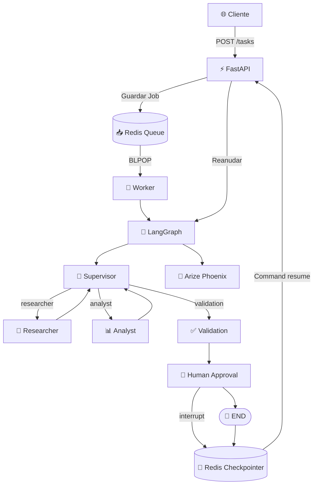

# 🤖 Pre-entrega 7: Sistema Multi-Agente Asíncrono con Redis y Human-in-the-Loop

## 📌 Descripción

Este proyecto implementa un **sistema multi-agente asíncrono** utilizando **Python, LangGraph, LangChain, Redis y FastAPI**.

La arquitectura evoluciona el orquestador multi-agente de la Pre-entrega 6 incorporando:

* 👑 **Supervisor** para coordinar el flujo.
* 🔎 **Researcher** para investigar información.
* 📊 **Analyst** para analizar los resultados.
* ✅ **Validation** para verificar que el proceso esté completo.
* 👤 **Human-in-the-Loop (HITL)** para solicitar aprobación humana antes de finalizar.
* 🧠 **Estado persistente** mediante Redis.
* 📥 **Redis Queue** para desacoplar la API de la ejecución.
* 👷 **Worker asíncrono** encargado de procesar los trabajos.
* 💾 **Redis Checkpointer** para conservar el estado de LangGraph.
* 🔭 **Arize Phoenix** para observabilidad y trazabilidad.
* 🌐 **FastAPI** como interfaz REST.
* 🤖 **OpenAI / MockLLM** para permitir ejecución con o sin API.

La arquitectura permite que la API reciba una consulta y responda inmediatamente con un identificador de trabajo, mientras un Worker independiente ejecuta el procesamiento en segundo plano.

---

# 🎯 Objetivo

El objetivo de esta práctica es construir un sistema capaz de:

1. Recibir una consulta mediante una API REST.
2. Crear un trabajo independiente.
3. Encolar el trabajo en Redis.
4. Procesarlo mediante un Worker asíncrono.
5. Ejecutar un flujo multi-agente con LangGraph.
6. Investigar la información necesaria.
7. Analizar los resultados.
8. Validar que el proceso esté completo.
9. Pausar la ejecución mediante Human-in-the-Loop.
10. Esperar una decisión humana.
11. Reanudar el grafo utilizando el checkpoint persistido.
12. Finalizar o rechazar el trabajo.
13. Conservar el estado de ejecución en Redis.
14. Registrar trazas de la ejecución mediante Phoenix.

---

# 🏗️ Arquitectura general

La arquitectura combina una API REST, una cola de trabajos, un Worker, LangGraph y Redis.



---

# 🔄 Flujo completo

El procesamiento de un trabajo sigue el siguiente flujo:

```text
Cliente
   ↓
POST /tasks
   ↓
FastAPI
   ↓
Redis Queue
   ↓
Worker
   ↓
LangGraph
   ↓
Supervisor
   ↓
Researcher
   ↓
Supervisor
   ↓
Analyst
   ↓
Supervisor
   ↓
Validation
   ↓
Human-in-the-Loop
   ↓
interrupt()
   ↓
Redis Checkpoint
   ↓
waiting_approval
   ↓
Aprobación humana
   ↓
Command(resume)
   ↓
LangGraph
   ↓
END
```

La API y el procesamiento están desacoplados.

La API no ejecuta directamente el flujo completo de LangGraph al recibir una consulta.

En cambio, crea un trabajo y lo coloca en una cola.

---

# ⚡ FastAPI

FastAPI funciona como la interfaz REST del sistema.

La API proporciona los siguientes endpoints:

| Método | Endpoint                  | Función                 |
| ------ | ------------------------- | ----------------------- |
| POST   | `/tasks`                  | Crear un trabajo        |
| GET    | `/tasks/{job_id}`         | Consultar el estado     |
| POST   | `/tasks/{job_id}/approve` | Aprobar o rechazar HITL |
| GET    | `/health`                 | Verificar Redis         |

---

# 📥 POST /tasks

Este endpoint recibe una consulta:

```json
{
    "query": "Analizá el impacto de la inteligencia artificial en el mercado laboral."
}
```

La API genera un identificador único:

```text
job_id
```

y crea un registro en Redis:

```json
{
    "job_id": "...",
    "query": "...",
    "status": "pending",
    "result": null,
    "error": null
}
```

Luego agrega el `job_id` a la cola:

```text
ai_tasks_queue
```

Finalmente responde inmediatamente:

```json
{
    "job_id": "...",
    "status": "pending"
}
```

La ejecución de LangGraph ocurre posteriormente en el Worker.

---

# 📊 Estados de un Job

Un trabajo puede atravesar diferentes estados:

```text
pending
   ↓
running
   ↓
waiting_approval
   ↓
completed
```

También puede finalizar como:

```text
rejected
```

o:

```text
failed
```

El flujo general es:

```text
pending
   │
   ▼
running
   │
   ├───────────────► failed
   │
   ▼
waiting_approval
   │
   ├───────────────► rejected
   │
   ▼
completed
```

---

# 📥 Redis Queue

Redis funciona como sistema de mensajería entre FastAPI y el Worker.

La cola utilizada es:

```text
ai_tasks_queue
```

Cuando la API recibe un trabajo utiliza:

```python
await redis_client.rpush(
    QUEUE_NAME,
    job_id,
)
```

El Worker consume trabajos utilizando:

```python
await redis_client.blpop(
    QUEUE_NAME,
    timeout=5,
)
```

Esto permite desacoplar:

```text
API
```

de:

```text
Procesamiento
```

La API puede continuar respondiendo nuevas solicitudes mientras el Worker procesa los trabajos.

---

# 👷 Worker

El Worker es un proceso independiente encargado de consumir trabajos de Redis.

Su responsabilidad es:

1. Esperar nuevos trabajos.
2. Obtener el `job_id`.
3. Recuperar la consulta desde Redis.
4. Actualizar el estado a `running`.
5. Ejecutar LangGraph.
6. Detectar interrupciones HITL.
7. Guardar el estado correspondiente.
8. Marcar el trabajo como completado o fallido.

El Worker se inicia mediante:

```bash
py app/worker.py
```

Su ciclo principal utiliza:

```python
BLPOP
```

para esperar nuevos trabajos sin necesidad de realizar polling constante.

---

# 🧠 LangGraph

LangGraph controla la ejecución del sistema multi-agente.

El grafo contiene los siguientes nodos:

```text
supervisor
researcher
analyst
validation
human_approval
```

El punto inicial es:

```text
supervisor
```

---

# 👑 Supervisor

El Supervisor es el controlador central.

Analiza el estado actual y determina qué componente debe intervenir.

Las opciones posibles son:

```text
researcher
analyst
validation
FINISH
```

El Supervisor utiliza el modelo configurado en `llm.py`.

El estado contiene:

```text
research_results
analysis_results
validation_result
```

A partir de estos valores se determina qué etapas ya fueron completadas.

---

# 🔀 Routing dinámico

El routing se implementa utilizando `Conditional Edges`.

```python
workflow.add_conditional_edges(
    "supervisor",
    route_supervisor,
    {
        "researcher": "researcher",
        "analyst": "analyst",
        "validation": "validation",
        "FINISH": END,
    },
)
```

La función:

```python
route_supervisor()
```

devuelve el siguiente nodo.

Esto permite mantener el control centralizado del flujo.

---

# 🔎 Researcher

El Researcher es responsable de la etapa de investigación.

Utiliza la herramienta:

```text
search_knowledge_base
```

La herramienta consulta la base de conocimiento simulada del proyecto.

La información disponible incluye datos relacionados con:

* Inteligencia artificial.
* Automatización.
* Productividad.
* Mercado laboral.
* Empleo.

El resultado se almacena en:

```text
research_results
```

Después de completar su trabajo, el flujo vuelve al Supervisor.

---

# 📊 Analyst

El Analyst procesa la información producida por Researcher.

Utiliza la herramienta:

```text
calculate_average
```

Esta herramienta permite calcular el promedio de valores numéricos.

Por ejemplo:

```text
10
20
30
40
```

produce:

```text
25.00
```

El resultado del análisis se almacena en:

```text
analysis_results
```

Después de finalizar, el flujo vuelve al Supervisor.

---

# ✅ Validation

Validation es una etapa determinística.

Su objetivo es comprobar que los resultados necesarios existan:

```text
research_results
analysis_results
```

Si alguno falta, la ejecución no puede considerarse completa.

Cuando ambos resultados están disponibles, Validation genera:

```text
VALIDATION OK
```

y actualiza:

```text
validation_result
```

La validación no depende de una decisión del LLM.

Esto proporciona una condición de finalización controlada.

---

# 👤 Human-in-the-Loop

Una de las principales incorporaciones de esta pre-entrega es el mecanismo de **Human-in-the-Loop**.

Después de que Researcher, Analyst y Validation terminan, el sistema llega al nodo:

```text
human_approval
```

Este nodo utiliza:

```python
interrupt()
```

La interrupción contiene información para el usuario:

```python
approval = interrupt(
    {
        "type": "human_approval",
        "message": (
            "La tarea fue investigada, analizada "
            "y validada. Se requiere aprobación "
            "humana para finalizar."
        ),
    }
)
```

En este punto LangGraph pausa la ejecución.

El estado queda persistido mediante el checkpointer.

---

# ⏸️ Estado waiting_approval

Cuando el Worker detecta:

```text
__interrupt__
```

actualiza Redis:

```json
{
    "status": "waiting_approval"
}
```

Esto permite que la API pueda informar que el trabajo está esperando una decisión humana.

El Worker no vuelve a ejecutar el trabajo desde cero.

La ejecución queda pausada.

---

# ✔️ Aprobación humana

La decisión se envía mediante:

```text
POST /tasks/{job_id}/approve
```

con:

```json
{
    "approved": true
}
```

La API utiliza:

```python
Command(
    resume=request.approved
)
```

junto con el mismo:

```text
thread_id = job_id
```

Esto permite recuperar el checkpoint correspondiente y continuar la ejecución.

---

# ❌ Rechazo humano

También es posible rechazar la ejecución:

```json
{
    "approved": false
}
```

El nodo HITL recibe:

```python
False
```

y devuelve:

```python
{
    "human_approved": False,
    "task_completed": False,
}
```

La API marca el trabajo como:

```text
rejected
```

---

# 💾 Persistencia

El sistema utiliza Redis para dos responsabilidades diferentes.

## Redis como Queue

Almacena trabajos pendientes:

```text
ai_tasks_queue
```

## Redis como almacenamiento de estados

Almacena información del Job:

```text
task_status:{job_id}
```

## Redis como Checkpointer de LangGraph

LangGraph utiliza:

```python
AsyncRedisSaver
```

para almacenar checkpoints de la ejecución.

El grafo se compila con:

```python
app = workflow.compile(
    checkpointer=checkpointer
)
```

Esto permite recuperar el estado asociado al:

```text
thread_id
```

y es especialmente importante para Human-in-the-Loop.

Los checkpointers de LangGraph guardan snapshots del estado del grafo y permiten ejecución durable y reanudación de flujos interrumpidos.

---

# 🔐 Thread ID

Cada Job recibe un UUID:

```python
job_id = str(uuid.uuid4())
```

Ese identificador se utiliza también como:

```text
thread_id
```

Ejemplo:

```python
config = {
    "configurable": {
        "thread_id": job_id,
    }
}
```

Esto conecta:

```text
Job
  ↓
Redis
  ↓
LangGraph
  ↓
Checkpoint
  ↓
Human Approval
  ↓
Resume
```

El mismo `thread_id` permite que la ejecución pueda continuar desde el punto donde fue interrumpida.

---

# 🔭 Observabilidad con Arize Phoenix

El proyecto incorpora **Arize Phoenix** para observar las ejecuciones de LangChain/LangGraph.

La configuración se encuentra en:

```text
app/observability.py
```

Se registra un `TracerProvider` mediante:

```python
register(
    project_name=PHOENIX_PROJECT,
    endpoint=PHOENIX_ENDPOINT,
    auto_instrument=False,
    batch=False,
)
```

Luego se activa:

```python
LangChainInstrumentor().instrument(
    tracer_provider=_tracer_provider
)
```

Esto permite visualizar las trazas generadas durante la ejecución.

---

# 📊 Phoenix

La configuración utilizada es:

```env
PHOENIX_ENDPOINT=http://localhost:6006/v1/traces
PHOENIX_PROJECT=pre-entrega-7
```

La interfaz de Phoenix queda disponible en:

```text
http://localhost:6006
```

El proyecto incluye evidencias visuales:

```text
screenshots/
├── phoenix-researcher.png
└── phoenix-trace.png
```

Estas capturas muestran la instrumentación y las trazas generadas durante la ejecución del sistema.

---

# 🧠 OpenAI / MockLLM

El proyecto mantiene compatibilidad con dos modalidades.

## OpenAI

Cuando existe:

```env
OPENAI_API_KEY=...
```

se utiliza el modelo configurado en:

```text
app/llm.py
```

## MockLLM

Cuando no existe una API configurada, el proyecto puede utilizar un modelo simulado.

Esto permite ejecutar la arquitectura sin depender obligatoriamente de una API externa.

El objetivo del MockLLM es permitir probar:

```text
Supervisor
Researcher
Analyst
```

sin necesidad de credenciales externas.

---

# 📁 Estructura del proyecto

```text
pre-entrega-7/
│
├── app/
│   │
│   ├── agents/
│   │   ├── __init__.py
│   │   ├── research_agent.py
│   │   ├── analyst_agent.py
│   │   └── validation_agent.py
│   │
│   ├── __init__.py
│   ├── graph.py
│   ├── hitl.py
│   ├── llm.py
│   ├── main.py
│   ├── observability.py
│   ├── redis_client.py
│   ├── state.py
│   ├── test_hitl.py
│   ├── test_persistence.py
│   └── worker.py
│
├── screenshots/
│   ├── phoenix-researcher.png
│   └── phoenix-trace.png
│
├── .env
├── .env.example
├── .gitignore
├── docker-compose.yml
├── phoenix_setup.py
├── pytest.ini
├── requirements.txt
└── README.md
```

---

# 📄 Descripción de archivos

## `app/graph.py`

Contiene la arquitectura principal de LangGraph:

* Supervisor.
* Researcher.
* Analyst.
* Validation.
* Human Approval.
* Conditional Edges.
* Redis Checkpointer.
* `interrupt()`.
* Compilación del grafo.

---

## `app/worker.py`

Implementa el Worker.

Sus responsabilidades son:

* Consumir Redis Queue.
* Ejecutar LangGraph.
* Actualizar estados.
* Detectar interrupciones.
* Guardar trabajos pendientes de aprobación.
* Gestionar errores.

---

## `app/main.py`

Implementa la API REST utilizando FastAPI.

Contiene:

```text
POST /tasks
GET /tasks/{job_id}
POST /tasks/{job_id}/approve
GET /health
```

---

## `app/llm.py`

Gestiona la selección del modelo:

```text
OpenAI
```

o:

```text
MockLLM
```

---

## `app/state.py`

Define el estado compartido utilizado por LangGraph.

Incluye los resultados de cada etapa y la información necesaria para controlar el flujo.

---

## `app/observability.py`

Configura:

```text
Arize Phoenix
OpenTelemetry
OpenInference
```

---

## `app/redis_client.py`

Centraliza la configuración de Redis utilizada por el proyecto.

---

## `app/test_hitl.py`

Contiene pruebas relacionadas con el mecanismo Human-in-the-Loop.

---

## `app/test_persistence.py`

Contiene pruebas relacionadas con la persistencia del estado.

---

# 🐳 Redis con Docker

Redis se ejecuta mediante Docker Compose.

El archivo:

```text
docker-compose.yml
```

define:

```yaml
services:

  redis:
    image: redis:7-alpine
    container_name: pre-entrega-7-redis
    ports:
      - "6376:6379"
    volumes:
      - redis_data:/data
    command: redis-server --appendonly yes
    restart: unless-stopped
```

El puerto utilizado desde la aplicación es:

```text
6376
```

mientras que Redis escucha internamente en:

```text
6379
```

---

# ⚙️ Instalación

## 1. Clonar el repositorio

```bash
git clone <URL_DEL_REPOSITORIO>
```

Entrar al proyecto:

```bash
cd pre-entrega-7
```

---

# 2. Crear entorno virtual

En Windows:

```bash
py -m venv venv
```

Activar:

```bash
venv\Scripts\activate
```

---

# 3. Instalar dependencias

```bash
py -m pip install -r requirements.txt
```

Las dependencias principales incluyen:

```text
fastapi
uvicorn
pydantic
python-dotenv
redis
langgraph
langgraph-checkpoint-redis
langchain
langchain-core
langchain-openai
langsmith
typing-extensions
```

Para la observabilidad también deben estar instaladas las dependencias utilizadas por:

```text
phoenix.otel
openinference.instrumentation.langchain
```

---

# 🔐 Configuración

Crear un archivo:

```text
.env
```

con:

```env
REDIS_URL=redis://localhost:6376

QUEUE_NAME=ai_tasks_queue

STATUS_PREFIX=task_status:

PHOENIX_ENDPOINT=http://localhost:6006/v1/traces

PHOENIX_PROJECT=pre-entrega-7
```

Si se desea utilizar OpenAI:

```env
OPENAI_API_KEY=tu_api_key
```

El archivo `.env` no debe subirse al repositorio.

---

# ▶️ Ejecución

La arquitectura requiere varios procesos.

## 1. Iniciar Redis

Desde la raíz:

```bash
docker compose up -d
```

Verificar:

```bash
docker ps
```

Debe aparecer:

```text
pre-entrega-7-redis
```

---

# 2. Iniciar Phoenix

Iniciar Arize Phoenix en el puerto configurado:

```text
6006
```

Luego acceder a:

```text
http://localhost:6006
```

---

# 3. Iniciar Worker

En una terminal:

```bash
py app/worker.py
```

Debe aparecer:

```text
============================================================
👷 WORKER INICIADO
============================================================
```

También debería mostrar:

```text
🔭 Observabilidad: Phoenix ACTIVO
```

y:

```text
✅ RedisSaver configurado.
```

---

# 4. Iniciar FastAPI

En otra terminal:

```bash
uvicorn app.main:app --reload
```

La API estará disponible en:

```text
http://127.0.0.1:8000
```

La documentación interactiva puede consultarse mediante Swagger.

---

# 🧪 Demo

La demostración completa consiste en crear un trabajo y observar cómo atraviesa todo el sistema.

---

## Paso 1 — Crear un Job

Enviar:

```http
POST /tasks
```

con:

```json
{
    "query": "Analizá el impacto de la inteligencia artificial en el mercado laboral."
}
```

La API devuelve:

```json
{
    "job_id": "UUID",
    "status": "pending"
}
```

---

# Paso 2 — Worker

El Worker detecta:

```text
📥 Nuevo Job recibido
```

y cambia el estado:

```text
pending
↓
running
```

---

# Paso 3 — LangGraph

El Supervisor decide:

```text
👑 SUPERVISOR
└── Próximo agente: researcher
```

Researcher ejecuta:

```text
🔎 RESEARCHER
└── Investigación completada
```

---

# Paso 4 — Analyst

El Supervisor vuelve a intervenir:

```text
👑 SUPERVISOR
└── Próximo agente: analyst
```

Analyst procesa los resultados:

```text
📊 ANALYST
└── Análisis completado
```

---

# Paso 5 — Validation

El Supervisor selecciona:

```text
validation
```

Validation verifica:

```text
Investigación: OK
Análisis: OK
```

y genera:

```text
VALIDATION OK
```

---

# Paso 6 — Human-in-the-Loop

El grafo llega a:

```text
human_approval
```

y ejecuta:

```python
interrupt(...)
```

El Worker detecta:

```text
⏸️ LANGGRAPH PAUSADO
```

y actualiza Redis:

```text
waiting_approval
```

En este punto el trabajo permanece pausado.

---

# Paso 7 — Consultar estado

Utilizar:

```http
GET /tasks/{job_id}
```

La respuesta debe indicar:

```json
{
    "job_id": "...",
    "status": "waiting_approval",
    "result": "La tarea requiere aprobación humana."
}
```

---

# Paso 8 — Aprobar

Enviar:

```http
POST /tasks/{job_id}/approve
```

con:

```json
{
    "approved": true
}
```

La API ejecuta:

```python
Command(
    resume=True
)
```

utilizando el mismo:

```text
thread_id
```

LangGraph recupera el checkpoint y continúa la ejecución.

---

# Paso 9 — Finalización

Si la aprobación es positiva:

```text
human_approval
      ↓
END
```

y Redis registra:

```text
completed
```

---

# ❌ Demo de rechazo

También puede probarse:

```json
{
    "approved": false
}
```

El resultado esperado es:

```text
rejected
```

Esto demuestra que la decisión humana modifica el resultado final de la ejecución.

---

# 🔭 Evidencia de observabilidad

Durante la ejecución se pueden observar las trazas en Phoenix.

El proyecto incluye:

```text
screenshots/phoenix-researcher.png
```

y:

```text
screenshots/phoenix-trace.png
```

Estas evidencias permiten demostrar la instrumentación del flujo multi-agente.

---

# 🧪 Pruebas

El proyecto incluye pruebas específicas para:

```text
test_hitl.py
```

y:

```text
test_persistence.py
```

Las pruebas permiten verificar:

* Interrupción HITL.
* Reanudación.
* Persistencia.
* Estado del grafo.
* Uso del checkpoint.

Ejecutar:

```bash
pytest
```

---

# 🛡️ Manejo de errores

El Worker captura excepciones durante la ejecución:

```python
except Exception as error:
```

y actualiza el Job:

```text
failed
```

almacenando también:

```text
error
```

Esto permite que la API pueda informar el fallo sin perder el registro del trabajo.

---

# 🔄 Desacoplamiento

Una de las principales características de la arquitectura es el desacoplamiento entre API y procesamiento.

```text
                 ┌───────────────┐
                 │    FastAPI    │
                 └───────┬───────┘
                         │
                         ▼
                 ┌───────────────┐
                 │     Redis     │
                 │     Queue     │
                 └───────┬───────┘
                         │
                         ▼
                 ┌───────────────┐
                 │    Worker     │
                 └───────┬───────┘
                         │
                         ▼
                 ┌───────────────┐
                 │   LangGraph   │
                 └───────────────┘
```

Esto permite que el procesamiento pueda evolucionar independientemente de la API.

---

# 🧩 Tecnologías utilizadas

| Tecnología         | Responsabilidad           |
| ------------------ | ------------------------- |
| Python 3.12        | Lenguaje principal        |
| FastAPI            | API REST                  |
| Uvicorn            | Servidor ASGI             |
| LangGraph          | Orquestación del grafo    |
| LangChain          | Framework de agentes      |
| OpenAI             | LLM opcional              |
| MockLLM            | Ejecución sin API         |
| Redis              | Cola y persistencia       |
| Redis Checkpointer | Persistencia de LangGraph |
| Docker             | Infraestructura Redis     |
| Arize Phoenix      | Observabilidad            |
| OpenInference      | Instrumentación           |
| Pydantic           | Validación de datos       |
| pytest             | Testing                   |

---

# 🎓 Relación con los criterios de evaluación

## Arquitectura

El proyecto implementa:

* Arquitectura multi-agente.
* Supervisor.
* Conditional Edges.
* Routing dinámico.
* Estado compartido.
* Redis Queue.
* Worker.
* API REST.
* Persistencia.

---

## Especialización

Los agentes poseen responsabilidades separadas:

```text
Researcher
    ↓
Investigación

Analyst
    ↓
Análisis

Validation
    ↓
Validación
```

El Supervisor mantiene el control del flujo global.

---

## Persistencia

El proyecto utiliza:

```text
Redis
+
AsyncRedisSaver
+
thread_id
```

para conservar el estado del grafo.

Esto resulta especialmente importante para Human-in-the-Loop.

---

## Human-in-the-Loop

La ejecución incorpora:

```python
interrupt()
```

para pausar el grafo y:

```python
Command(
    resume=...
)
```

para reanudarlo después de recibir una decisión humana.

---

## Observabilidad

La ejecución se instrumenta mediante:

```text
OpenTelemetry
+
OpenInference
+
Arize Phoenix
```

permitiendo inspeccionar las trazas generadas por los agentes.

---

# 🚀 Conclusión

La Pre-entrega 7 evoluciona el sistema multi-agente anterior hacia una arquitectura asíncrona y persistente.

La combinación de:

```text
FastAPI
+
Redis Queue
+
Worker
+
LangGraph
+
Supervisor
+
Researcher
+
Analyst
+
Validation
+
Human-in-the-Loop
+
Redis Checkpointer
+
Arize Phoenix
```

permite construir un sistema capaz de recibir trabajos, procesarlos de forma desacoplada, conservar su estado y solicitar intervención humana antes de finalizar.

El uso de Redis permite separar la recepción de solicitudes de la ejecución.

LangGraph administra el flujo multi-agente y la persistencia de los checkpoints.

El mecanismo Human-in-the-Loop permite pausar la ejecución mediante `interrupt()` y reanudarla posteriormente mediante `Command(resume=...)`.

Finalmente, Arize Phoenix permite observar las trazas producidas durante la ejecución.

---

# 👩‍💻 Autor

**Agustina Esteban**

Proyecto desarrollado como parte de la:

**Pre-entrega 7 — Sistema Multi-Agente Asíncrono con Redis, Persistencia y Human-in-the-Loop**
